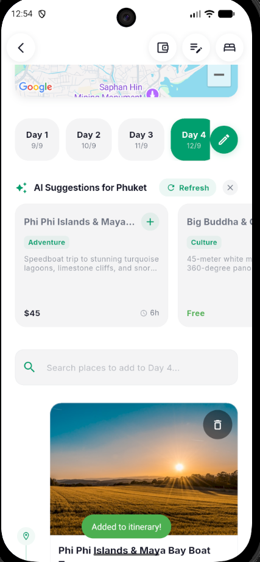
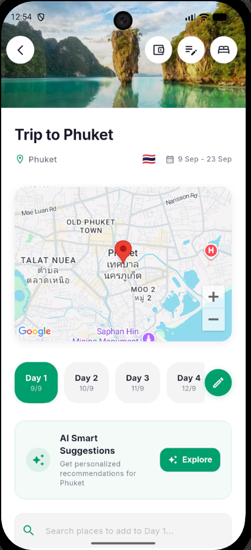
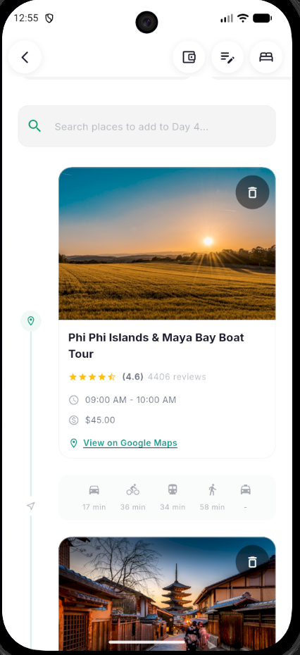
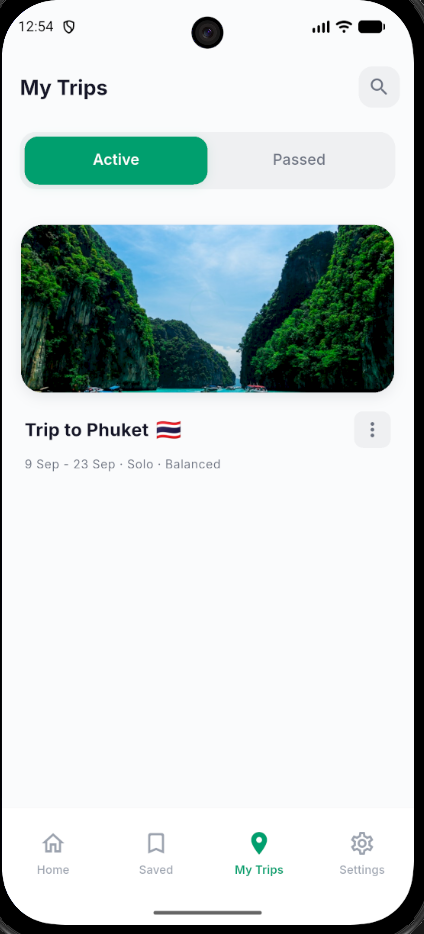
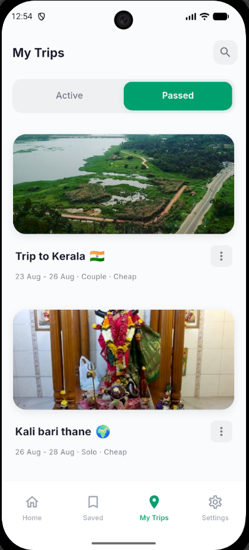
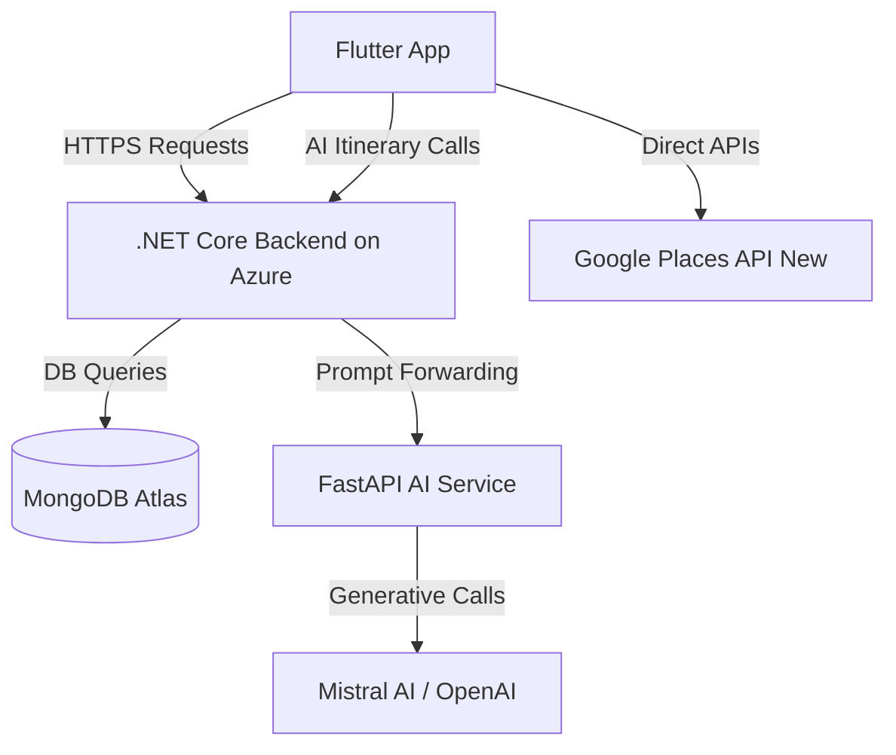

<p align="center">
  
</p>

<p align="center">
  <a href="#"></a>
</p>

<p align="center">
  
</p>

<p align="center">
  <strong>NEW: AI-generated day-by-day itineraries, now with collaborative editing — <a href="#features--screenshots">see it below</a></strong>
</p>

<h1 align="center">Your ultimate AI travel planning app</h1>

<p align="center">
  <a href="#">WanderSouls</a>: an alternative to TripIt, Wanderlog, Google Trips...<br/>
  WanderSouls offers everything you need to plan a trip, organize the details,<br/>
  and travel with a group — without twelve tabs open.
</p>

<p align="center">
  
  
  
  
  
</p>

<p align="center">
  <a href="#getting-started"><strong>Explore the docs »</strong></a>
</p>

<p align="center">
  <a href="https://github.com/<your-org>/wander-souls/issues/new?labels=bug">Report Bug</a>
  ·
  <a href="https://github.com/<your-org>/wander-souls/issues/new?labels=enhancement">Request Feature</a>
  ·
  <a href="LICENSE">License</a>
</p>

---

## Features & Screenshots

| AI Itinerary & Smart Suggestions | Destination Explorer & Map | Activity & Transit Breakdown |
| :---: | :---: | :---: |
| <br/><sub>Smart suggestions tailored to destination & days</sub> | <br/><sub>Interactive Google Maps & day-by-day plan</sub> | <br/><sub>Activity booking, pricing & transit estimates</sub> |

<br/>

| Active Trip Management | Past Trips & Travel Archive |
| :---: | :---: |
| <br/><sub>Manage active & upcoming itineraries</sub> | <br/><sub>Browse past completed trips and memories</sub> |

---

## Overview

- AI-generated, cost-optimized day-by-day itineraries — transport, lodging, food, and sightseeing in one plan
- Rich destination data pulled live from the Google Places API (New): ratings, reviews, hours, photos
- Drag-and-drop timeline editing on any active trip
- Invite friends or family to co-edit an itinerary in real time
- Keep tickets, bookings, and confirmation PDFs attached to the trip they belong to

## Tech Stack

- Flutter (v3.22+) · Dart · BLoC pattern · Dio HTTP client · ScreenUtil
- .NET Core Web API on Azure App Services — auth, trip metadata, collaborators, files
- FastAPI (Python 3.10+) AI proxy — prompt schemas + JSON validation against Mistral AI / OpenAI
- MongoDB Atlas
- Google Places API (New) & Google Maps SDK

## System Architecture



---

## Getting Started

**Prerequisites:** Flutter SDK (v3.22+) · Python (3.10+) · Google Places API credentials

**1. Mobile client**
```bash
git clone https://github.com/<your-org>/wander-souls.git && cd wander-souls
echo "GOOGLE_API_KEY=your_google_key_here" > .env
flutter pub get && flutter run
```

**2. AI service**
```bash
cd ai_service
echo "MISTRAL_API_KEY=your_mistral_key_here" > .env
pip install -r requirements.txt
uvicorn main:app --reload --host 0.0.0.0 --port 8000
```

---

## Support the Project

If WanderSouls saved you some trip-planning headaches:

- Star the repo — it's the easiest way to help others find it
- [Buy me a coffee](https://www.buymeacoffee.com/<your-handle>)
- [Open an issue](https://github.com/<your-org>/wander-souls/issues) for bugs or ideas

## Star History

[](https://star-history.com/#<your-org>/wander-souls&Date)

## License

This repository's source code is available under the [MIT License](LICENSE).